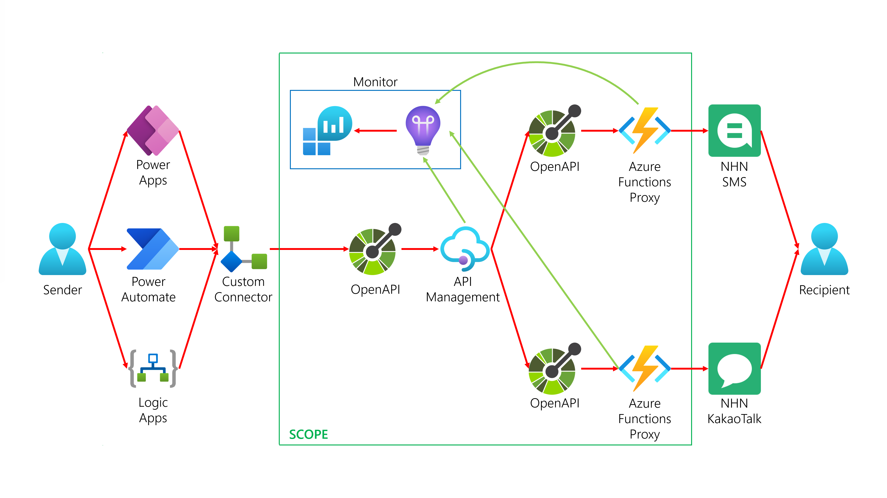

# NHN Toast Notification Service Custom Connector #

This is to provide [Microsoft Power Platform](http://powerplatform.microsoft.com/?WT.mc_id=dotnet-58531-juyoo) with a custom connector for NHN Toast Notification Services including [SMS/MMS](https://www.toast.com/kr/service/notification/sms) and [KakaoTalk messages](https://www.toast.com/kr/service/notification/kakaotalk-bizmessage).

## High-Level Architecture ##

The elements in the green rectangle is the scope of this project.

* **[Azure Functions](https://azure.microsoft.com/services/functions/?WT.mc_id=dotnet-58531-juyoo) Proxy**: It works as a facade to NHN Notification Services ([SMS/MMS](https://www.toast.com/kr/service/notification/sms) and [KakaoTalk messages](https://www.toast.com/kr/service/notification/kakaotalk-bizmessage)) to handle requests.
* **[Azure API Management](https://azure.microsoft.com/services/api-management/?WT.mc_id=dotnet-58531-juyoo)**: It aggregates all the requests from the sender and the responses from the NHN Notification Services ([SMS/MMS](https://www.toast.com/kr/service/notification/sms) and [KakaoTalk messages](https://www.toast.com/kr/service/notification/kakaotalk-bizmessage)).
* **[OpenAPI](https://github.com/OAI/OpenAPI-Specification/blob/main/versions/3.0.1.md)**: It is a contract between [Azure API Management](https://azure.microsoft.com/services/api-management/?WT.mc_id=dotnet-58531-juyoo) and [Azure Functions](https://azure.microsoft.com/services/functions/?WT.mc_id=dotnet-58531-juyoo) Proxy, and between [Custom Connector](https://docs.microsoft.com/connectors/custom-connectors/?WT.mc_id=dotnet-58531-juyoo) and [Azure API Management](https://azure.microsoft.com/services/api-management/?WT.mc_id=dotnet-58531-juyoo).
* **[Azure Monitor](https://azure.microsoft.com/services/monitor/?WT.mc_id=dotnet-58531-juyoo)**: [Azure Monitor](https://azure.microsoft.com/services/monitor/?WT.mc_id=dotnet-58531-juyoo) includes [Azure Application Insights](https://docs.microsoft.com/azure/azure-monitor/app/app-insights-overview?WT.mc_id=dotnet-58531-juyoo) and [Azure Log Analytics](https://docs.microsoft.com/azure/azure-monitor/logs/log-analytics-overview?WT.mc_id=dotnet-58531-juyoo) to monitor/trace/observe requests/responses.

## Getting Started ##

### GitHub Secrets ###

Following GitHub Secrets are required for CI/CD pipelines:

* `AZURE_CREDENTIALS`: Credentials that Azure issues. To get the Azure Credentials, refer to [this page](https://github.com/Azure/login#configure-deployment-credentials).
* `AZURE_RESOURCE_NAME`: Resource name. For example, if your Azure Resource Group is `rg-nt-dev-krc`, `nt` is the resource name.
* `AZURE_ENVIRONMENT_CODE`: Environment code. For example, if your Azure Resource Group is `rg-nt-dev-krc`, `dev` is the environment code.
* `AZURE_LOCATION_CODE`: Location code. For example, if your Azure Resource Group is `rg-nt-dev-krc`, `krc` is the location code.
* `TOAST_APPKEY`: AppKey that NHN Toast issues.
* `TOAST_SECRETKEY`: SecretKey that NHN Toast issues.

The following GitHub Secrets will be deprecated soon.

* `REQUEST_ID`: Any request ID that was used to send SMS messages for testing.
* `SENDER_NO`: Any registered and verified sender number for integration tests.
* `RECIPIENT_NO`: Any registered and verified recipient number for integration tests.
  
> Make sure that the `RECIPIENT_NO` is the mobile phone number authorised for testing purpose only and used with care. If you use unauthorised mobile phone numbers, you might be involved with legal actions.

### Local Development ###

#### Prerequisites for Local Development ####

* [Visual Studio 2022 or later](https://visualstudio.microsoft.com/vs/?WT.mc_id=dotnet-58531-juyoo) &ndash; Windows only
* [Visual Studio Code](https://code.visualstudio.com/?WT.mc_id=dotnet-58531-juyoo)
* [Azure Functions Core Tools](https://docs.microsoft.com/azure/azure-functions/functions-run-local?WT.mc_id=dotnet-58531-juyoo)
* [PowerShell](https://docs.microsoft.com/powershell/scripting/overview?WT.mc_id=dotnet-58531-juyoo)
* [Azure CLI](https://docs.microsoft.com/cli/azure/what-is-azure-cli?WT.mc_id=dotnet-58531-juyoo)
* [Power Platform CLI](https://docs.microsoft.com/power-apps/developer/data-platform/powerapps-cli?WT.mc_id=dotnet-58531-juyoo)
* [Docker Desktop](https://docs.docker.com/get-started/)

> Make sure that you might need to find Docker Desktop alternatives, if you're concerned about [Docker's licensing policy](https://www.docker.com/blog/the-grace-period-for-the-docker-subscription-service-agreement-ends-soon-heres-what-you-need-to-know/).

TBD

### Initial Autopilot to Azure ###

#### Prerequisites for Azure ####

* Azure account: [Get free account](https://azure.microsoft.com/free/?WT.mc_id=dotnet-58531-juyoo) or [get student account](https://azure.microsoft.com/free/students/?WT.mc_id=dotnet-58531-juyoo)

TBD

### Initial Autopilot to NHN Cloud ###

#### Prerequisites for NHN Cloud ####

* NHN Cloud account: [Get free account](https://www.toast.com/kr/pricing#event)

TBD

### Power Platform Integration ###

#### Prerequisites for Power Platform ####

* Microsoft 365 Developer account: [Get developer account](https://developer.microsoft.com/microsoft-365/dev-program?WT.mc_id=dotnet-58531-juyoo)
* Power Platform Developer account: [Get developer account](https://powerapps.microsoft.com/developerplan/?WT.mc_id=dotnet-58531-juyoo)

TBD

